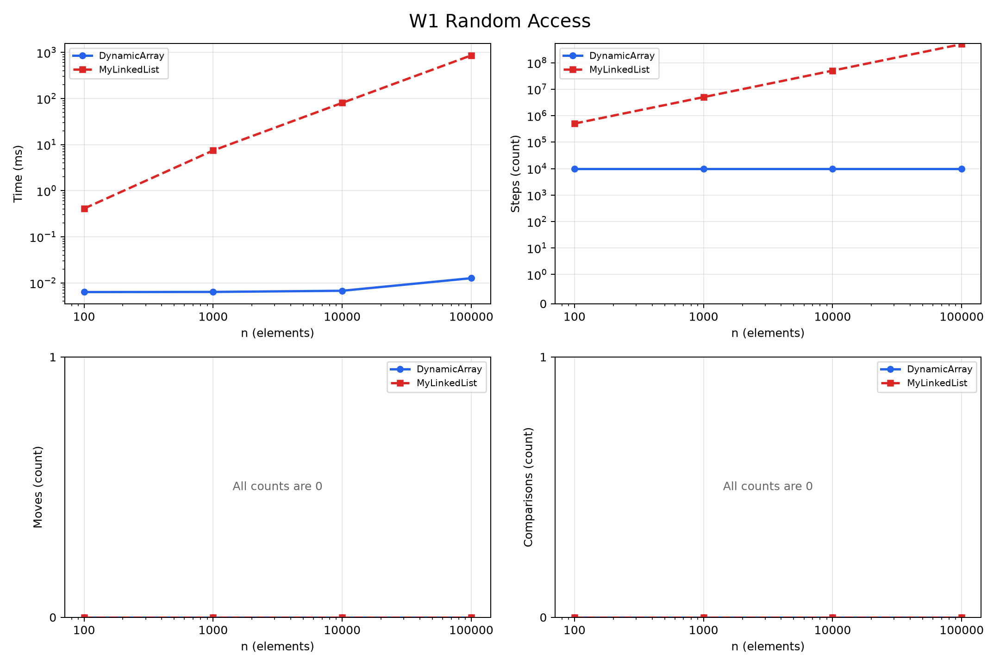
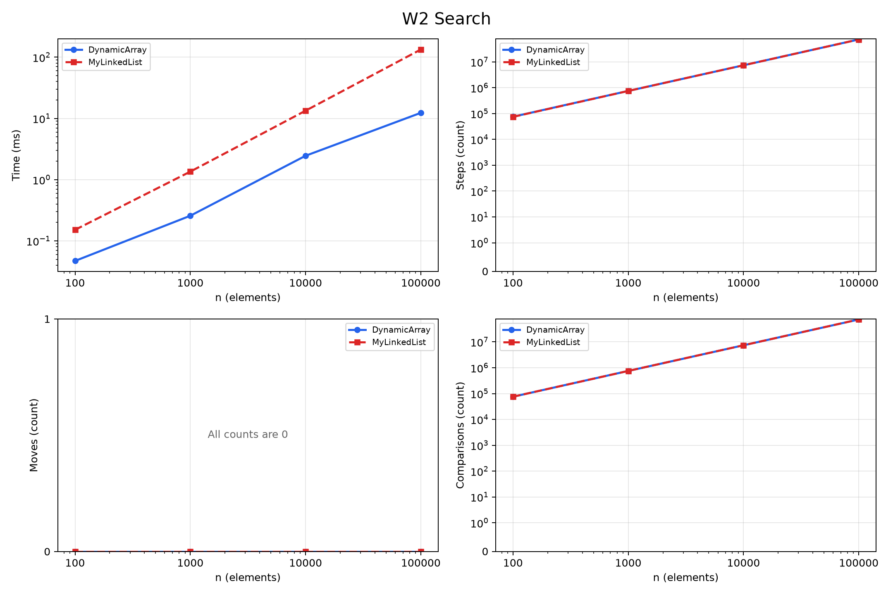
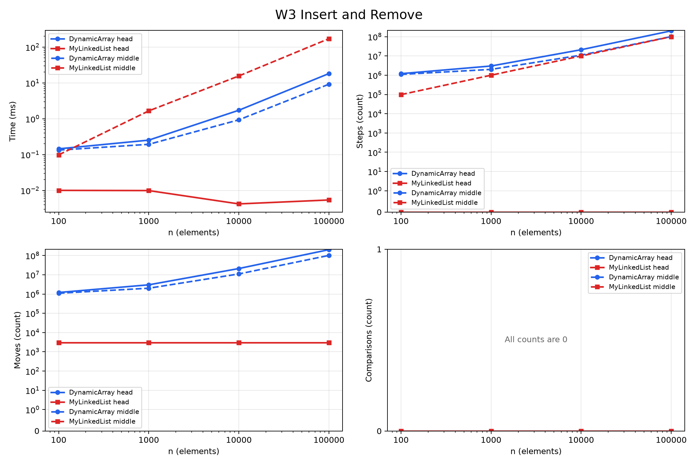
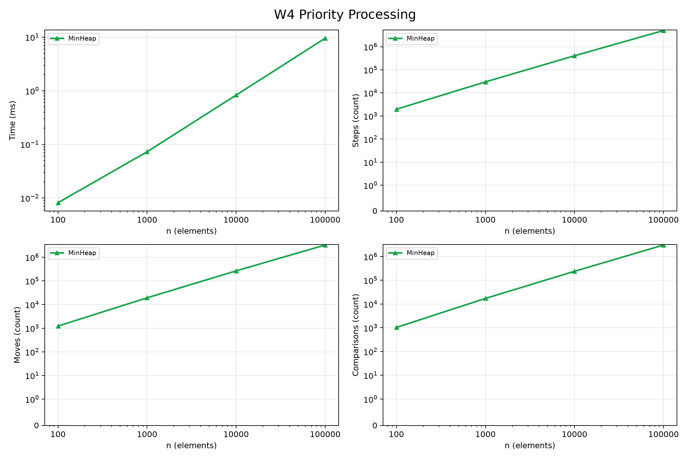

# Assignment 2 Report: Data Structures

## Method

The project compares a dynamic array, a singly linked list, and a binary min-heap storing `int` values. For every size, `new Random(42)` creates the same nonnegative input values for each structure. W1 runs 10,000 random indexed reads. W2 runs 1,000 searches with 500 present values and 500 guaranteed absent negative values. W3 performs 1,000 insertions followed by 1,000 removals at the head or the fixed middle index. W4 inserts all values into the heap, extracts all of them, and checks that the output is sorted.

The benchmark first warms up the JVM with all workloads. Each measured case then has two discarded warm-up runs and five timed runs. The CSV stores the median time and the counters from that median run. W1 to W3 fill their structures before timing. W4 times both insertion and extraction, then checks the extracted order after timing. A step means reading an array cell or following a list link, a move means relocating an array value or updating a list link, and a comparison means comparing two stored values. Copying an array during growth counts as reads and moves.

## Complexity

Here `n` is the current number of elements. The average column assumes a uniformly random valid index for indexed operations and random independent values for heap insertion. Growth costs are amortized across a sequence of insertions. The last column is extra space used by one call, not the total storage of the structure.

| Structure | Operation | Best | Average | Worst | Extra space | Reason |
| --- | --- | --- | --- | --- | --- | --- |
| DynamicArray | `add(x)` | Θ(1) | Θ(1) amortized | Θ(n) | Θ(n) on growth | Appending writes one cell, but growth copies all existing cells. |
| DynamicArray | `add(index,x)` | Θ(1) | Θ(n) | Θ(n) | Θ(n) on growth | An index near the front shifts most elements right. |
| DynamicArray | `remove(index)` | Θ(1) | Θ(n) | Θ(n) | Θ(1) | Removing the last value shifts nothing; earlier values shift left. |
| DynamicArray | `get(index)` | Θ(1) | Θ(1) | Θ(1) | Θ(1) | Direct addressing reads one array cell. |
| DynamicArray | `contains(x)` | Θ(1) | Θ(n) | Θ(n) | Θ(1) | The scan may stop at the first cell or visit all cells. |
| MyLinkedList | `add(x)` | Θ(1) | Θ(1) | Θ(1) | Θ(1) | The tail reference allows direct append. |
| MyLinkedList | `add(index,x)` | Θ(1) | Θ(n) | Θ(n) | Θ(1) | Head and tail are direct; a middle index needs traversal. |
| MyLinkedList | `remove(index)` | Θ(1) | Θ(n) | Θ(n) | Θ(1) | Removing the head is direct; other indexes need the previous node. |
| MyLinkedList | `get(index)` | Θ(1) | Θ(n) | Θ(n) | Θ(1) | The list follows links from the head to the index. |
| MyLinkedList | `contains(x)` | Θ(1) | Θ(n) | Θ(n) | Θ(1) | A match can be first, or the scan can reach the end. |
| MinHeap | `insert(x)` | Θ(1) | Θ(1) expected, amortized | Θ(n) | Θ(n) on growth | A random key usually rises few levels; growth copies the array. Without growth the worst case is Θ(log n). |
| MinHeap | `peekMin()` | Θ(1) | Θ(1) | Θ(1) | Θ(1) | The minimum is at index zero. |
| MinHeap | `extractMin()` | Θ(1) | Θ(log n) | Θ(log n) | Θ(1) | The replacement can move down the height of the tree. |

Each structure uses Θ(n) total storage. The heap insertion average is for random keys across repeated insertions, not an adversarial sequence. Average linear total swaps for repeated random heap insertion are also studied by [Hayward and McDiarmid](https://webdocs.cs.ualberta.ca/~hayward/papers/heap.pdf).

## Loop invariant 1: `DynamicArray.contains`

**Invariant.** Before iteration `i`, none of `data[0]` through `data[i - 1]` equals the search value.

**Initialization.** At `i = 0`, the examined prefix is empty, so the statement is true.

**Maintenance.** If `data[i]` equals the value, the method returns `true`. Otherwise that cell also differs from the value, so the invariant holds for the next iteration with prefix `0..i`.

**Termination.** If the loop reaches `i = size`, every stored cell has been checked and the method returns `false`. An earlier return is justified by the matching cell.

**Conclusion.** The method returns `true` exactly when the value occurs in the array.

## Loop invariant 2: `MinHeap.bubbleDown`

**Invariant.** Before each iteration, all heap edges satisfy parent ≤ child except possibly the edges from the node at `index` to its children. The subtrees rooted at those children are valid heaps.

**Initialization.** After `extractMin` moves the last value to the root, all other parent-child relations remain unchanged. Therefore only the new root may violate the heap property.

**Maintenance.** The loop chooses the smaller child. If the current value is larger, swapping it with that child makes the parent no larger than either child. Only the moved value at the chosen child may now violate relations below it, so the invariant holds at the new `index`.

**Termination.** The loop stops at a leaf or when the current value is no larger than its smaller child. In either case the possible violation is gone, so every edge satisfies the heap property.

**Conclusion.** `extractMin` returns the old root, and `bubbleDown` restores a valid heap for the remaining values.

## Results

The figures use a logarithmic `n` axis. The time panels use a logarithmic time axis, and operation panels show zero values explicitly. The full measurements are in `results/results.csv`.

## Discussion

At `n = 100,000`, W1 records 10,000 array reads but about 502 million list-link steps. The measured array time is about 0.013 ms, while the list takes about 861 ms in this run. Array values are packed in one `int[]`, so nearby values share CPU cache lines. A simple sequential iteration also benefits because the CPU can fetch following array cells before they are requested. List nodes live in separate objects, and the next address is known only after reading the current node's reference. This pointer chasing limits prefetching and can cause more cache misses. Each node also needs an object header and a reference, which increases memory use and garbage-collection work. In W2, both structures make about 73.7 million value comparisons at `n = 100,000`, yet the list takes about 134 ms and the array about 12 ms. The similar comparison count with different time shows why Big-O and comparison totals do not capture memory layout. In W3 at the head, the list changes links while the array moves about 201 million values, so the list is much faster. In W3 at the middle, both structures do linear work, but the array's contiguous shifts are faster than following about 100 million list links. `MyLinkedList` is useful for frequent head operations, while `MinHeap` is useful for processing jobs by minimum priority without scanning every item. Small timing differences may vary with JIT compilation, CPU load, and garbage collection, so the report uses medians rather than one run.
